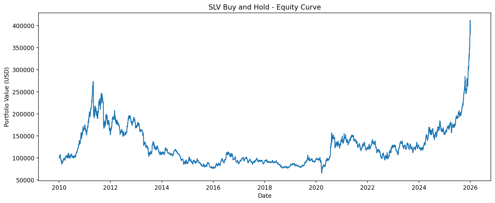
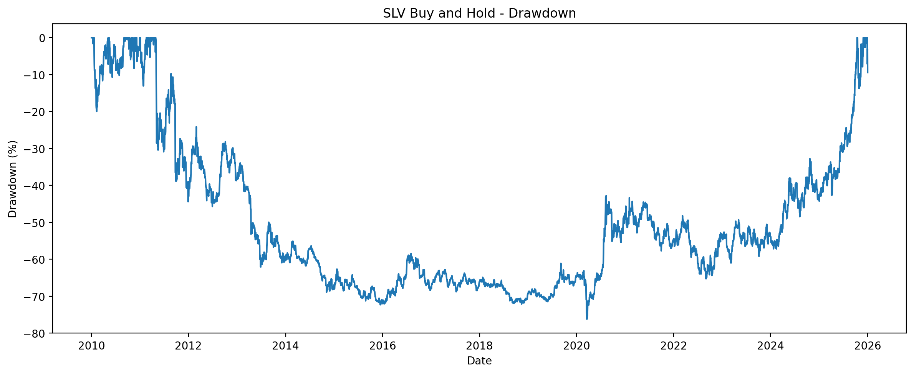

# SLV Buy-and-Hold Baseline

## Objective

Establish a passive benchmark for evaluating subsequent systematic strategies based on trend and volatility.

## Configuration

- **Asset:** SLV
- **Backtest period:** 2010-01-01 to 2025-12-31
- **Initial capital:** 100,000 USD
- **Data resolution:** Daily
- **Position:** 100% long
- **Leverage:** None
- **Short selling:** Disabled
- **Benchmark:** SLV
- **Total orders:** 1

## Results

| Metric | Value |
|---|---:|
| Initial equity | 100,000.00 USD |
| Final equity | 373,001.72 USD |
| Net profit | 273.00% |
| Annualized return | 8.57% |
| Annualized volatility | 24.17% |
| Sharpe ratio | 0.291 |
| Sortino ratio | 0.319 |
| Maximum drawdown | 76.20% |
| Total fees | 28.94 USD |
| Total orders | 1 |

## Equity Curve

The portfolio grew substantially over the full backtest period, increasing from 100,000 USD to approximately 373,002 USD. However, the trajectory was highly volatile and included long periods of decline and recovery.

## Drawdown

The strategy experienced a maximum drawdown of 76.2%. This means that, at its worst point, the portfolio had lost more than three quarters of its value relative to a previous peak before eventually recovering.

## Interpretation

The passive investment generated strong cumulative growth over the complete period, but the risk assumed was considerable.

The annualized return of 8.57% was accompanied by annualized volatility of 24.17%, resulting in a Sharpe ratio of 0.291. This indicates that the return achieved was modest relative to the magnitude of the fluctuations endured by the portfolio.

The maximum drawdown of 76.2% is the most relevant weakness of the benchmark. Although the investment finished with a positive return, an investor would have needed to tolerate a very severe and prolonged decline.

These results justify the main research objective of the project: to evaluate whether a trend-following strategy with volatility control can reduce severe drawdowns and improve risk-adjusted performance while preserving a reasonable level of long-term return.

## Notes on Trade Statistics

Trade-level statistics such as win rate, average win and average loss are not meaningful for this benchmark because the SLV position remained open at the end of the backtest.

QuantConnect therefore reports one order but zero closed trades.

## Baseline Criteria for Future Strategies

Future strategies will be evaluated against this benchmark using the following goals:

- Reduce the maximum drawdown below 76.2%.
- Improve the Sharpe ratio above 0.291.
- Maintain a reasonable annualized return.
- Limit transaction costs and unnecessary turnover.
- Demonstrate stable performance outside the development period.
- Avoid selecting parameters using the final test period.

## Conclusion

The buy-and-hold benchmark confirms that SLV offered substantial long-term appreciation during the selected period, but with very high downside risk and limited risk-adjusted efficiency.

A future strategy should not be judged solely by whether it exceeds the benchmark's total return. A lower return could still represent an improvement if it achieves materially lower drawdowns, reduced volatility and a higher Sharpe ratio.

## Disclaimer

This repository is an educational and research project. It does not constitute financial advice, investment advice or a recommendation to buy or sell any financial instrument.
